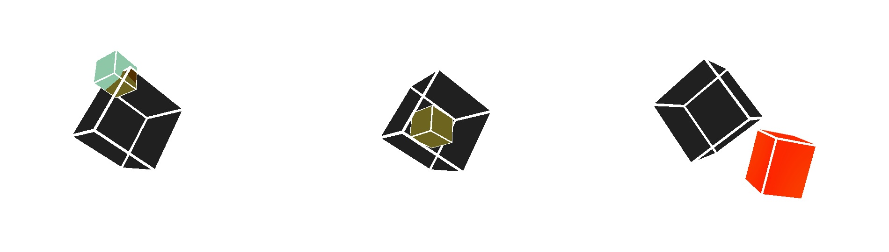

# Collision


**Collsion** is a proof of concept for a neural network to detect collsions of bodies. 

For training, validation and testing this project uses abstract Blender generated images (size: 540 x 540 x 3) of cubes. 
It uses as LeNet5 like architecture (see [convolutional network on wikipedia](https://en.wikipedia.org/wiki/Convolutional_neural_network) for more). 
The whole can be used as a template for other CNN projects. Feel free.

Hint: This project uses Keras as AI framework. 

## Usage
There are 5 steps to use it correctly

1. after downloading the whole repository, unpack the file full.zip in the data directory

2. After that shuffle the data by
  '''
  $ collision.py --shuffle
  '''

3. The model has to be trained
  '''
  $ collision.py --training
  '''

4. the model has to be tested
  '''
  $ collision.py --testing
  '''
  determines the quality of the trained model. Output is a dictionary with the summary of correct and false detections per category (in, out, collision). The only prerequisite for this option is that the model has been trained before (e.g by using the --training option) 

the commands can also be combined, e.g 
  '''
  $ collision.py --shuffle --trainig --testing --predict
  '''


5. The model can be used to make prediction (remember the image shoudl have resolutio  540 x 540 x 3)
  '''
  $ collision.py --predict "/path/to/the/image"
  '''

The whole commands are given by the following:

```shell
usage: collision.py [-h] [--shuffle] [--ptrain PTRAIN] [--pval PVAL]
                    [--ptest PTEST] [--epochs EPOCHS] [--training] [--testing]
                    [--predict PREDICT] [--verbose]

optional arguments:
  -h, --help         show this help message and exit
  --shuffle          shuffle the data before processing
  --ptrain PTRAIN    training percentage
  --pval PVAL        validation percentage
  --ptest PTEST      test percentage
  --epochs EPOCHS    number of epochs of training
  --training         call the training function
  --testing          call the testing function
  --predict PREDICT  prints the prediction array for an image to stdout
  --verbose          more verbose output to stdout
```

## Credits
Credits go to
* Blender.org offering this georguous program
* My son Leif who generated the images 
